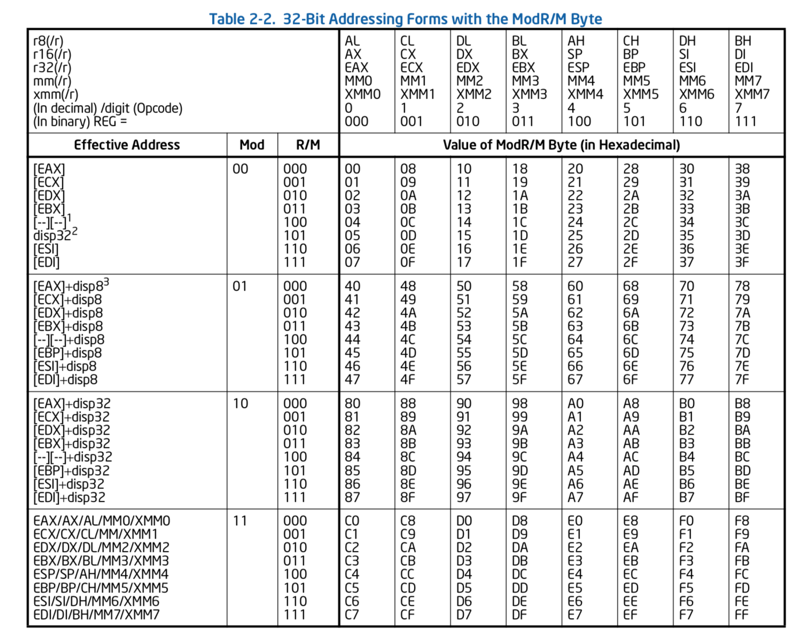

# Debugging shikata ga nai encoder
### Execve() shellcode running /bin/sh:
```
"\x31\xc0\x50\x68\x2f\x2f\x73\x68\x68\x2f\x62\x69\x6e\x89\xe3\x50\x89\xe2\x53\x89\xe1\xb0\x0b\xcd\x80"
25 bytes /bin/sh shellcode
```

### Msfvenom encodes shellcode with shikata ga nai (one iteration):
```
echo -ne "\x31\xc0\x50\x68\x2f\x2f\x73\x68\x68\x2f\x62\x69\x6e\x89\xe3\x50\x89\xe2\x53\x89\xe1\xb0\x0b\xcd\x80" | msfvenom -a x86 --platform linux -e x86/shikata_ga_nai -f c -p - 

"\xda\xc2\xd9\x74\x24\xf4\x58\x29\xc9\xbe\x45\x59\xe9\x68\xb1"
"\x07\x31\x70\x18\x83\xe8\xfc\x03\x70\x51\xbb\x1c\x59\x99\x6b"
"\xb7\xb5\x36\xff\x2f\xa2\x67\x9d\xc6\x5c\xfe\x82\x49\x28\xe2"
"\x16\xe3\xcb\x52\x93\x3e\x8b"
```
### Put this into c wrapper, compile with gcc 

```
gcc -fno-stack-protector -z execstack shellcode.c -o shellcode
gdb ./shellcode

(gdb) break *&code
Breakpoint 1 at 0x804a040
(gdb) r
Starting program: 
Shellcode Length:  52

Breakpoint 1, 0x0804a040 in code ()
(gdb) set disassembly-flavor intel
(gdb) disassemble 
Dump of assembler code for function code:
=> 0x0804a040 <+0>:	fcmovb st,st(2)
   0x0804a042 <+2>:	fnstenv [esp-0xc]
   0x0804a046 <+6>:	pop    eax
   0x0804a047 <+7>:	sub    ecx,ecx
   0x0804a049 <+9>:	mov    esi,0x68e95945
   0x0804a04e <+14>:	mov    cl,0x7
   0x0804a050 <+16>:	xor    DWORD PTR [eax+0x18],esi
   0x0804a053 <+19>:	sub    eax,0xfffffffc
   0x0804a056 <+22>:	add    esi,DWORD PTR [eax+0x51]
   0x0804a059 <+25>:	mov    ebx,0x6b99591c
   0x0804a05e <+30>:	mov    bh,0xb5
   0x0804a060 <+32>:	jmp    FWORD PTR ss:[edi]
   0x0804a063 <+35>:	mov    ds:0x5cc69d67,al
   0x0804a068 <+40>:	inc    BYTE PTR [edx+0x16e22849]
   0x0804a06e <+46>:	jecxz  0x804a03b
   0x0804a070 <+48>:	push   edx
   0x0804a071 <+49>:	xchg   ebx,eax
   0x0804a072 <+50>:	mov    eax,DWORD PTR ds:[eax]
End of assembler dump.

```
### Debugging the shikata ga nai encoder

The first two instructions fcmovb, fnstenv, store the FPU environment onto the stack and pop onto the eax register
Refer from: 
Intel® 64 and IA-32 Architectures Software Developer's Manual Volume 1: Basic Architecture Chapter 8.1.10

And next three just predefine the key for xor for first loop, and clear out the ecx and mov 7 to ecx counter for looping 
as the original shellcode only 25 bytes, and shikta ga nai encode 4 bytes per loop.
```
sub    ecx,ecx
mov    esi,0x68e95945
mov    cl,0x7

```

### Define a hook stop to exmine the process of decoding

```
(gdb) define hook-stop
Type commands for definition of "hook-stop".
End with a line saying just "end".
>disassemble 
>x/52xb &code
>end
```
x/52xb &code command shows 52 bytes from the ever begining of the shellcode to the last.

As the instruction, *xor    DWORD PTR [eax+0x18],esi*, indicates that XOR starts from 0x0804a040 + 0x18,
which is at 0x0804a058.

0x0804a056 <+22>:	add    esi,DWORD PTR [eax+0x51]
Decoding happens at the last byte of add instruction, which is the displacement part of the instruction. 

Exmine the opcode at **0x0804a056**   
*Before decoding:* 03 70 51    0x0804a056 <+22>:	add    esi,DWORD PTR [eax+0x51]  

*After decoding: *  03 70 14    0x0804a056 <+22>:	add    esi,DWORD PTR [eax+0x14]  

### The format of Intel instructions:

| INSTRUCTION PREFIX | OPCODE        | ModR/M             | SIB                | DISPLACEMENT   | IMMEDIATE      |
|:------------------:|:-------------:|:------------------:|:------------------:|:--------------:|:--------------:|
| Optional 1 Byte    | 1,2 or 3 Byte | 1 Byte if required | 1 Byte if required | 1, 2 or 4 Byte | 1, 2 or 4 Byte |


|OPCODE|ModR/M|DISPLACEMENT|
|---|---|---|
|03 |70 |51 |

The format of ModR/M Byte:

|Mod |Register/Opcode|R/M|
|---|---|---|
|0-1 bit |2-4 bit |5-7 bit|

For our instance Byte 0x70, the binary representation is:

0111 0000

- 01 is Mod bits
- 110 is Register bits representing Esi register in this case
- 000 is R/M bits representing Eax register and works with later displacement byte to identify an address of a memory




Notice that instruction at 0x0804a056 is changed to *0x0804a056 <+22>:	add    esi,DWORD PTR [eax+0x14]*
```
(gdb) stepi
Dump of assembler code for function code:
   0x0804a040 <+0>:	fcmovb st,st(2)
   0x0804a042 <+2>:	fnstenv [esp-0xc]
   0x0804a046 <+6>:	pop    eax
   0x0804a047 <+7>:	sub    ecx,ecx
   0x0804a049 <+9>:	mov    esi,0x68e95945
   0x0804a04e <+14>:	mov    cl,0x7
   0x0804a050 <+16>:	xor    DWORD PTR [eax+0x18],esi
=> 0x0804a053 <+19>:	sub    eax,0xfffffffc
   0x0804a056 <+22>:	add    esi,DWORD PTR [eax+0x14]
   0x0804a059 <+25>:	loop   0x804a050 <code+16>
   0x0804a05b <+27>:	xor    DWORD PTR [ecx+0x36b5b76b],ebx
   0x0804a061 <+33>:	jmp    FWORD PTR [edi]
   0x0804a063 <+35>:	mov    ds:0x5cc69d67,al
   0x0804a068 <+40>:	inc    BYTE PTR [edx+0x16e22849]
   0x0804a06e <+46>:	jecxz  0x804a03b
   0x0804a070 <+48>:	push   edx
   0x0804a071 <+49>:	xchg   ebx,eax
   0x0804a072 <+50>:	mov    eax,DWORD PTR ds:[eax]
End of assembler dump.
```
### 2's Complement Arithmetic
Now $eax = 0x0804a040, according to 2's complement in computer arithmetic  
*sub    eax,0xfffffffc* equals to *add eax, 0xfffffffc's complement*  

In computer, if the most significant bit is 1, then is is a negative number, the steps to find the 2's complement of a negative:
... Invert every bits, one to zero, zero to one
... Add one bit to the inverted

0x00000004 is the 2's complement of 0xfffffffc
then Eax now is set to 0x0804a044, Eax register works as an index pointer to the shellcode we want to decode.

Conclusion
---
Shikata ga nai encoder will set a predefined key to XOR first round, and add the key with the value of our shellcode every round,  makes the key unique every round for different shellcode. Using one of general purpose register, in this case, Eax as an index  pointing to shellcode that needs to be decoded. 

